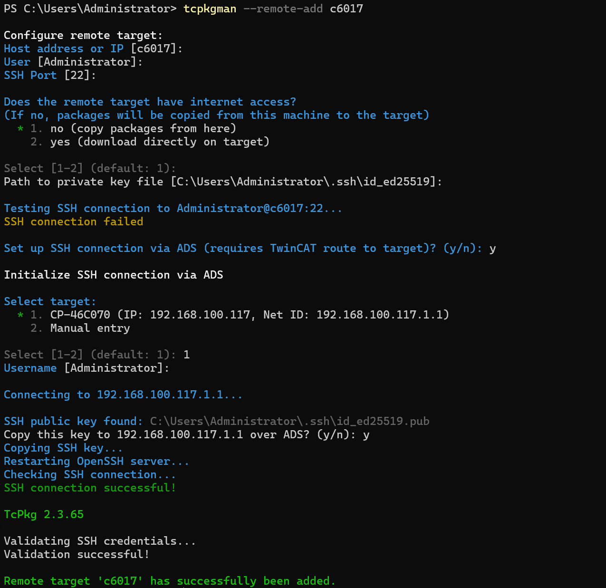

# tcpkgman

Experimental user-friendly tool for `TcPkg` to manage packages on remote TwinCAT PLC targets.

> **⚠️ Disclaimer**
>
> This is an experimental project and is **not affiliated with or endorsed by Beckhoff Automation**. Use at your own risk. The authors are not responsible for any damage or data loss that may occur from using this tool. Always test in a safe environment before using in production.

## Requirements

- Python 3.11+
- Windows OS
- [TcPkg](https://www.beckhoff.com/en-en/support/download-finder/) installed and in PATH (minimum tested version: `2.3.65`)
- **OpenSSH Server must be installed and running on the target IPC** (required for remote operations) - [Installation instructions](https://learn.microsoft.com/en-us/windows-server/administration/openssh/openssh_install_firstuse?tabs=gui&pivots=windows-11)

## Installation

### Install directly from GitHub:

```bash
pip install git+https://github.com/sgorsh/tcpkgman.git
```

### Or install from source (for development):

```bash
git clone https://github.com/sgorsh/tcpkgman.git
cd tcpkgman
pip install -e .
```

### Or run without installation:

```bash
python -m tcpkgman --help
```

## Usage

### Step 1: Add a Remote Target
> Administrator privileges are required by TcPkg to add and delete remote target

Before running any commands, you must first add a remote target configuration. This is a one-time setup for each target.

> **⚠️ Important**: The target IPC must have OpenSSH Server installed and running ([installation guide](https://learn.microsoft.com/en-us/windows-server/administration/openssh/openssh_install_firstuse?tabs=gui&pivots=windows-11)). SSH is required for all remote operations. Also ensure the firewall allows SSH connections (port 22).

#### Interactive Setup (Recommended)

```bash
# Add a remote target interactively (requires administrator privileges)
tcpkgman --remote-add myplc

# Or prompt for the remote name
tcpkgman --remote-add
```



During setup, you'll be prompted for:
- **Remote name**: A friendly name for this target (e.g., `myplc`)
- **Host address or IP**: The target's IP address or hostname (defaults to remote name)
- **Username**: SSH username (default: `Administrator`)
- **SSH port**: SSH port (default: `22`)
- **Internet access**: Whether the target can download packages directly from the internet. If no internet access is selected, packages will be automatically downloaded to your local machine and then copied to the target over SSH
- **SSH key**: Path to your SSH private key (auto-detected or generated)

The tool will automatically test the SSH connection and offer to set up SSH via ADS if needed.

#### List or Remove Remotes

```bash
# List all configured remote targets
tcpkgman --remote-list

# Remove a remote target (requires administrator privileges)
tcpkgman --remote-remove myplc
```

### Step 2: Run Commands

Once a remote target is configured, you can run any TcPkg command against it:

#### Install Packages

```bash
# Install a specific package
tcpkgman --remote myplc install TwinCAT.Standard.XAR=4026.19.0

# List installed packages
tcpkgman --remote myplc list --installed

# Uninstall a package
tcpkgman --remote myplc uninstall TwinCAT.Standard.XAR

# Install multiple packages from a TwinCAT Package Manager export file
tcpkgman --remote myplc import -i packages.config
```

### All TcPkg Commands Supported

tcpkgman passes all commands directly to TcPkg:

```bash
# Search for packages
tcpkgman --remote myplc search keyword

# Show package details
tcpkgman --remote myplc show TwinCAT.Standard.XAR

# Upgrade remote TcPkg
tcpkgman --remote myplc upgrade tcpkg

# Upgrade packages
tcpkgman --remote myplc upgrade TwinCAT.Standard.XAR

# And any other TcPkg command...
```

### Optional: Environment Variable

Set the `TCPKG_REMOTE` environment variable to avoid specifying `--remote` on every command:

**Windows (Command Prompt):**
```cmd
set TCPKG_REMOTE=myplc
tcpkgman install TwinCAT.Standard.XAR=4026.19.0
tcpkgman list --installed
```

**Windows (PowerShell):**
```powershell
$env:TCPKG_REMOTE = "myplc"
tcpkgman install TwinCAT.Standard.XAR=4026.19.0
tcpkgman list --installed
```

The `--remote` flag takes precedence over the environment variable:
```bash
# Uses environment variable
tcpkgman install pkg

# Overrides environment variable
tcpkgman --remote otherplc install pkg
```

### Optional: Initialize SSH via ADS

If SSH connection fails during `--remote-add`, tcpkgman automatically offers to set up SSH via ADS. You can also run this separately:

```bash
tcpkgman --remote-ssh-init
```

This interactively sets up SSH keys on a TwinCAT target via the ADS protocol.

**Requirements:**
- **OpenSSH Server MUST be installed and running on target**
- **Firewall must allow SSH connections**
- TwinCAT Router installed (provides TcAdsDll.dll)
- AMS route configured to target in TwinCAT Router

## Appendix: Installing OpenSSH Server on Target IPC

**Note:** These instructions are for Windows systems only.

> **⚠️ Security Warning**: Opening SSH port 22 exposes your system to potential security risks. Only enable SSH access on trusted networks (e.g., isolated industrial networks). Consider the following:
> - **Configure server to accept SSH keys instead of passwords** See instructions below 
> - **Keep OpenSSH Server updated** to patch security vulnerabilities
> - **Limit access** to specific IP addresses if possible using firewall rules
> - **Do not expose port 22 to the public internet** without additional security measures (VPN, port forwarding restrictions, etc.)

To install OpenSSH Server on the target IPC using PowerShell:

1. **Run PowerShell as an Administrator**

2. **Check if OpenSSH is available:**
    ```powershell
    Get-WindowsCapability -Online | Where-Object Name -like 'OpenSSH*'

    Name  : OpenSSH.Server~~~~0.0.1.0
    State : NotPresent
    ```

3. **Install the OpenSSH Server:**
    ```powershell
    # Install the OpenSSH Server
    Add-WindowsCapability -Online -Name OpenSSH.Server~~~~0.0.1.0
    ```

4. **Start and configure OpenSSH Server** (open an elevated PowerShell prompt):
    ```powershell
    # IMPORTANT: Disable password authentication for security   
    # Uncomments and sets 'PasswordAuthentication no'
    (Get-Content "C:\ProgramData\ssh\sshd_config") -replace '^#?PasswordAuthentication.*', 'PasswordAuthentication no' | Set-Content "C:\ProgramData\ssh\sshd_config"

    # Start the sshd service
    Start-Service sshd

    # Verify current PasswordAuthentication setting
    Select-String -Path "C:\ProgramData\ssh\sshd_config" -Pattern "PasswordAuthentication"

    # Set service to start automatically
    # SSH server will start automatically after a reboot.
    Set-Service -Name sshd -StartupType 'Automatic'

    # Create firewall rule if not created by setup
    # NOTE: This will add rule for all network profiles (Private, Public, Domain)
    if (!(Get-NetFirewallRule -Name "OpenSSH-Server-In-TCP" -ErrorAction SilentlyContinue)) {
        Write-Output "Firewall Rule 'OpenSSH-Server-In-TCP' does not exist, creating it..."
        New-NetFirewallRule -Name 'OpenSSH-Server-In-TCP' -DisplayName 'OpenSSH Server (sshd)' -Enabled True -Direction Inbound -Protocol TCP -Action Allow -LocalPort 22 -Profile Any
    } else {
        Write-Output "Firewall rule 'OpenSSH-Server-In-TCP' has been created and exists."
    }
    ```

## License

MIT
